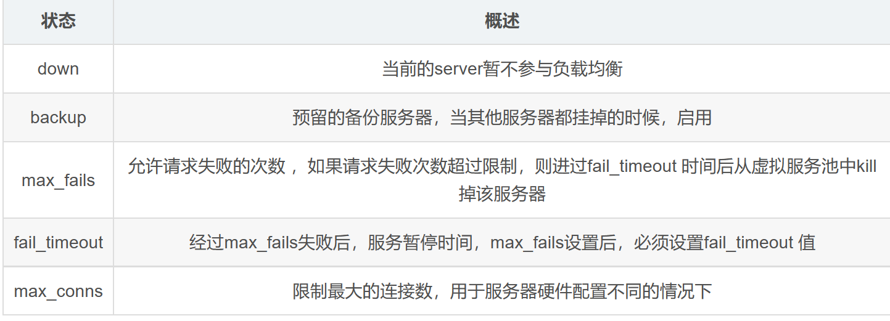
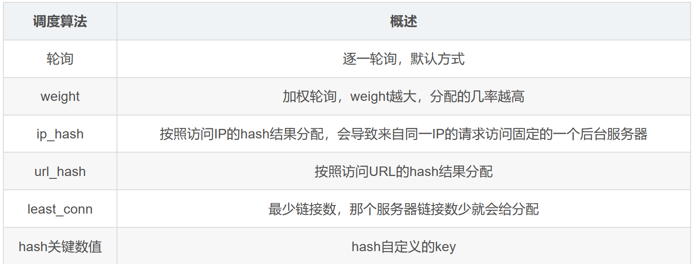

# Nginx Note
1. nginx简介
   1. 反向代理
   2. 负载均衡
   3. 动静分离
2. 反向代理
   * 正向代理：客户端配置代理服务器，通过代理服务器进行对真实服务器的访问（隐藏客户端）
   * 反向代理：客户端将请求发送至反向代理服务器，由反向代理服务器去选择目标服务器（隐藏服务器）
3. 负载均衡
   通过反向代理服务器平均分发请求，至服务器集群
4. 动静分离
   动态页面和静态页面请求分发给不同服务器
5. nginx常用命令
   ```bash
   nginx -v 查看版本
   nginx -s stop 关闭nginx
   nginx -s reload 重新加载nginx
   ./nginx 启动nginx
   nginx -c path_to_nginx.conf 指定配置文件启动 
   ```
6. 网络常用命令
   ```bash
   ps -ef | grep nginx 查看端口/服务状态
   netstat -ntlp 查看运行中端口及pid
   kill pid 终止指定pid服务
   firewall-cmd --state 查看防火墙运行情况
   firewall-cmd --zone=public --add-port=<port>/tcp --permanent 开放port端口
   firewall-cmd --list-all 查看防火墙开放端口&状态
   ```
7. nginx.conf
   1. 全局块
   2. events块：nginx配置与用户网络连接
      1. 最大连接数：`worker_connections  1024`
   3. http块：
      1. http全局块
      2. server块：配置虚拟主机，一个server块对应一个虚拟主机
         1. server全局块
         2. location块
8. nginx反向代理实验一
   * 需求：同时打开nginx（80端口）和tomcat（8080）服务，使用nginx反向代理，访问80(对外暴露的端口)时跳转8080端口
   * 在`conf.d/default.conf`下：
   ```json
   server {
      listen       80;
      server_name  43.163.231.32;

      location / {
         root   /usr/share/nginx/html;
         proxy_pass http://127.0.0.1:8080;
         index  index.html index.htm;
      }

      error_page   500 502 503 504  /50x.html;
      location = /50x.html {
         root   /usr/share/nginx/html;
      }
   }
   ```
   1. 在server全局块中添加对应公网IP的`server_name`
   2. 在location块中添加`proxy_pass`配置代理
   3. `.conf`文件对应该域名的server块配置
9.  nginx反向代理实验二  
   * 需求
     * ip:80/edu/a.html => ip:8080/edu/a.html（tomcat1）
     * ip:80/vod/a.html => ip:8081/vod/a.html（tomcat2)
   * 在`conf.d/default.conf`下：
   ```json
   location ~ /edu/ {
        proxy_pass http://127.0.0.1:8080;
    }

    location ~ /vod/ {
        proxy_pass http://127.0.0.1:8081;
    }
   ```
   * location配置规则
      1. =，精准匹配
      2. ~，正则匹配，区分大小写
      3. ~*，正则匹配，不区分大小写
      4. ^~，前缀匹配
      5. 无，默认为大小写敏感，前缀匹配
      6. @，内部跳转规则
   * location 优先级
      1. =
      2. ^~
      3. ~
      4. ~*
      5. /xxx
      6. /
10. nginx 负载均衡实验
    *  需求，访问ip:80/edu/a.html，有两台tomcat服务器分别在8080,8081端口启动，进行负载均衡
    *  在`nginx.conf`中添加
    ```json
      upstream myserver{
         ip_hash;
         server 43.163.231.32:8080 weight=3;
         server 43.163.231.32:8081 weight=1;
      }
    ```
    * 在`conf.d/default.conf`中添加
    ```json
     location / {
        root /usr/share/nginx/html;
        proxy_pass http://myserver;
        index index.html index.htm;
    }
    ```  
    
    
1.  